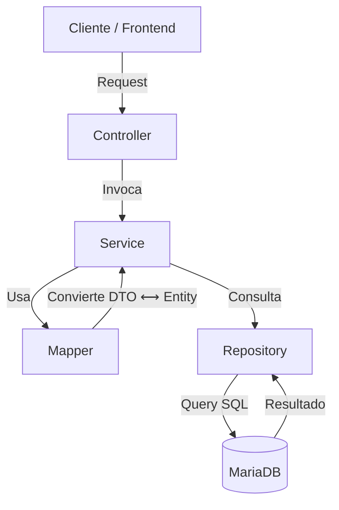

# 🚀 Administración de Etapas - Gestión de Proyectos de Software
> **Mapeo Objeto/Relacional**


> **API REST** desarrollada con Spring Boot, enfocada en la administración de etapas dentro del ciclo de vida de proyectos de software.

Este proyecto implementa una **arquitectura limpia por capas**, gestión de base de datos con **MariaDB**, control de versiones de base de datos con **Flyway**

---
> Miembros del equipo:
* **Hernández Herrera Jesus**
* **Martinez Hernández Carlos**
* **Salazar Hernández Abraham**


## ✨ Características

* **CRUD Completo** para la gestión de etapas.
* **Arquitectura por Capas** para desacoplar lógica y persistencia.
* **Migraciones de BD** automáticas con Flyway.
* **Uso de DTOs y Mappers** para proteger la entidad de dominio.

---

## 🏛️ Arquitectura y Estructura

El flujo de datos sigue un diseño estricto para asegurar la mantenibilidad:


## 📂 Estructura de Carpetas
```
src/main/java/mx.uacm.edu.proyectofinal
│
├── controller/
│   └── Controladores REST - Endpoints de la API
│
├── dto/
│   └── Data Transfer Objects - Objetos de transferencia de datos
│
├── entity/ (o model/)
│   └── Entidades JPA - Modelo de la base de datos
│
├── repository/
│   └── Repositorios JPA - Acceso a datos
│
├── mapper/
│   └── Conversión entre DTOs y Entidades
│
├── service/
│   └── Interfaces de servicios - Contratos de lógica de negocio
│
├── service/impl/
│   └── Implementaciones de servicios - Lógica de negocio
│
├── exception/
│   └── Excepciones personalizadas y manejo global de errores
│
└── util/
    └── Clases utilitarias y helpers

```

## 🛠️ Tecnologías Utilizadas

```
| Tecnología              | Propósito                         |
|-------------------------|-----------------------------------|
| **Java 17**             | Lenguaje de programación          |
| **Spring Boot 3.2.6**   | Framework principal               |
| **Spring Data JPA**     | Persistencia y ORM                |
| **Spring Web**          | Creación de API REST              |
| **Flyway**              | Migraciones de base de datos      |
| **MariaDB**             | Motor de base de datos            |
| **Lombok**              | Reducción de código repetitivo    |
| **Maven**               | Gestión de dependencias           |

```


 ## 🗄️ Base de Datos (MariaDB)

El proyecto utiliza **Flyway** para la gestión de versiones del esquema de la base de datos y **MariaDB** como motor principal.

---

### 🔌 Configuración de Conexión (*application.properties*)

```properties
# ==============================
#   CONEXIÓN A BASE DE DATOS
# ==============================
spring.datasource.url=jdbc:mariadb://localhost:3306/etapasdb
spring.datasource.username=usuario
spring.datasource.password=contraseña
spring.datasource.driver-class-name=org.mariadb.jdbc.Driver

### CONFIGURACIÓN JPA / HIBERNATE
# validate → Verifica que las entidades coincidan con las tablas creadas por Flyway
spring.jpa.hibernate.ddl-auto=validate

# Mostrar SQL formateado en consola
spring.jpa.show-sql=true
spring.jpa.properties.hibernate.format_sql=true

# CONFIGURACIÓN DE FLYWAY
spring.flyway.enabled=true
spring.flyway.locations=classpath:db/migration

spring.flyway.url=${spring.datasource.url}
spring.flyway.user=${spring.datasource.username}
spring.flyway.password=${spring.datasource.password}

```
**Migraciones Flyway**


Los archivos deben estar en:


*src/main/resources/db/migration*

## 📦 Endpoints Principales

```
| Método | Endpoint         | Descripción              |
| ------ | ---------------- | ------------------------ |
| GET    | /api/etapas      | Obtener todas las etapas |
| GET    | /api/etapas/{id} | Obtener etapa por ID     |
| POST   | /api/etapas      | Crear nueva etapa        |
| PUT    | /api/etapas/{id} | Actualizar etapa         |
| DELETE | /api/etapas/{id} | Eliminar etapa           |

```
## ▶️ Ejecución del Proyecto
Prerrequisitos
Java 17

Maven

MariaDB Server corriendo

## Paso 1: Clonar el repositorio
*git clone https://github.com/CarlosMtzRock/proyecto-mapache*

cd proyecto-final-mapeo
o importar a IntelliJ IDEA

## Paso 2: Crear la Base de Datos

Ingresa a tu cliente de MariaDB y crea una base de datos con el nombre:


*etapasdb;* y configurar el aplications.properties para añadir usuario, contraseña de tu bd

Paso 3: Ejecutar la aplicación
